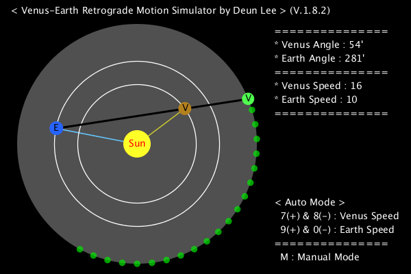

# Venus-Earth Simulator

A simple Venus-Earth simulator for observing [apparent retrograde motion][wiki-en] 
[겉보기 역행 운동][wiki-kr]을 관찰하기 위한 간단한 금성-지구 시뮬레이터

When observing a planet or celestial body on Earth, 
it move in one direction and then briefly in the opposite direction.
This phenomenon, called apparent retrograde motion, is caused by a difference in orbital speed.
This happens because the closer to the sun, the faster the revolution.
It is observed in both inner and outer planets.

When I was a high school student, I made it to study this a bit more in science class.
Later, I had the opportunity to present on this topic, and I also demonstrated this simulator.

지구에서 행성이나 천체를 관측하다 보면 한 방향으로 이동하다가, 
어느 순간 잠시 반대 방향으로 이동하는 경우가 있습니다.
겉보기 역행 운동이라고 불리는 이 현상은 공전 속도의 차이로 인해 일어납니다.
태양에 가까울수록 공전 속도가 빠르기 때문에 일어나며, 내행성과 외행성에서 모두 관찰됩니다.

고등학교 지구과학 시간에 이 현상을 좀 더 탐구해보기 위해 만들었고,
이 주제로 발표할 기회가 생겨 시연했습니다.

+ Distance from the sun : real ratio.
+ Speed of revolution : real ratio. (default)
+ Size of the planet : larger than the actual size. (for visibility)
+ Green/Red circle : Venus in the celestial sphere. (and it changes in size in proportion to the distance from Earth.)

In manual mode, you can change the speed and direction.

## Demo

## Download
[Here!](https://github.com/deunlee/Venus-Earth-Simulator/releases)

## License
[MIT License](./LICENSE)

[wiki-en]: https://en.wikipedia.org/wiki/Apparent_retrograde_motion
[wiki-kr]: https://ko.wikipedia.org/wiki/%EA%B2%89%EB%B3%B4%EA%B8%B0_%EC%97%AD%ED%96%89_%EC%9A%B4%EB%8F%99
